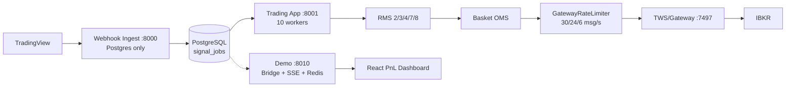

# IBKR Paper Trading System — Documentation Portal

**Current codebase:** commit `acdd451` (2026-08-28) — decoupled webhook ingest, `GatewayRateLimiter`, managedAccounts gate, critical recovery hardening, process supervisor.

> **Agent entrypoint:** [`AGENTS.md`](AGENTS.md) — hard invariants, run commands, which doc to open.
> **Docs index:** [`docs/README.md`](docs/README.md) — curated doc inventory with accuracy labels.

---

## 1. Overview

Paper trading execution for TradingView signals via IBKR TWS/Gateway. The system ingests webhooks durably, fans out per strategy to enabled accounts, checks risk, and submits multi-leg baskets through a single paced Gateway socket with crash-safe claims and kill-switch flatten.

**High-level shape:**



**Not built:** N-Gateway pool, per-Gateway limiters, reconnect-on-drop — see [`docs/backend-multi-gateway.md`](docs/backend-multi-gateway.md).

---

## 2. Architecture

| Topic | Doc |
|-------|-----|
| Trading signal lifecycle (ingest → queue → worker → RMS → basket → fills) | [`docs/backend-execution.md`](docs/backend-execution.md) |
| Jobs, workers, leases, claims, recovery | [`docs/backend-concurrency.md`](docs/backend-concurrency.md) |
| Package tree & lifespan (`app.main:app` vs `app.webhook_ingest:app`) | [`docs/backend-map.md`](docs/backend-map.md) |
| RMS checks, basket states, OMS, TWS adapter, GatewayRateLimiter | [`docs/backend-rms-oms.md`](docs/backend-rms-oms.md) |
| Multi-account (one socket) vs multi-gateway target | [`docs/backend-multi-gateway.md`](docs/backend-multi-gateway.md) |
| Kill switch, emergency flatten, leftover flatten script | [`docs/backend-kill-switch.md`](docs/backend-kill-switch.md) |
| Paper ports, STK→CFD, pacing, safety | [`docs/safety.md`](docs/safety.md) |
| What's not implemented | [`docs/gaps.md`](docs/gaps.md) |

---

## 3. Core Trading Components

| Component | Implementation | Doc |
|-----------|---------------|-----|
| Signal ingestion (HTTP 202, idempotency, disk capture) | `backend/app/api/routes/webhooks.py`, `backend/app/webhook_ingest.py` | [`backend-execution.md`](docs/backend-execution.md) |
| Signal parsing (Model Blue parser/sizer) | `backend/app/services/model_blue/*`, `backend/app/services/strategies/*` | same |
| Account routing / allocation | `backend/app/accounts/router.py` | [`backend-rms-oms.md`](docs/backend-rms-oms.md) |
| RMS (checks 2/3/4/7/8) | `backend/app/rms/engine.py` | same |
| OMS / BasketCoordinator (PENDING→EXECUTING→OPEN/CLOSED/COMPENSATED/CRITICAL/RECOVERED) | `backend/app/oms/coordinator.py` | same |
| Execution adapter (IBKR contracts, `ib_order.account` tag) | `backend/app/oms/ibkr_adapter.py` | same |
| TWS client + managedAccounts gate | `backend/app/broker/ibkr/tws_client.py` | same |
| GatewayRateLimiter (P0 flatten reserve) | `backend/app/broker/ibkr/gateway_rate_limiter.py` | same |
| Critical recovery (auto-flatten CRITICAL) | `backend/app/services/critical_recovery.py` | [`backend-rms-oms.md#basket-atomicity`](docs/backend-rms-oms.md) |
| Position reconciliation & live PnL | `backend/app/services/position_reconciler.py`, `backend/app/services/pnl.py` | [`backend-map.md`](docs/backend-map.md) |
| Kill switch | `backend/app/services/kill_switch.py` | [`backend-kill-switch.md`](docs/backend-kill-switch.md) |

---

## 4. Backend

| Topic | Doc |
|-------|-----|
| HTTP API (webhook :8000, trading :8001, demo :8010) | [`docs/backend-api.md`](docs/backend-api.md) |
| Configuration (`Settings`, `DemoStreamSettings`, env) | [`docs/backend-config.md`](docs/backend-config.md) |
| Database (tables, repos, Alembic, Redis scope) | [`docs/backend-persistence.md`](docs/backend-persistence.md) |
| Testing (`pytest`, fixtures, suites) | [`docs/backend-testing.md`](docs/backend-testing.md) |
| Conventions (how to add a route, DI, docs hygiene) | [`docs/conventions.md`](docs/conventions.md) |

Application structure details: [`docs/backend-map.md`](docs/backend-map.md).

---

## 5. IBKR Integration

| Topic | Doc |
|-------|-----|
| Gateway, IBC, TWS connection lifecycle, managedAccounts | [`docs/backend-rms-oms.md`](docs/backend-rms-oms.md) + [`docs/backend-map.md`](docs/backend-map.md) |
| Order execution flow, pacing, retries (paper `{7497,4002}`) | [`docs/backend-rms-oms.md`](docs/backend-rms-oms.md) |
| Paper vs live ports, STK→CFD override | [`docs/safety.md`](docs/safety.md) |
| Multi-gateway target architecture | [`docs/backend-multi-gateway.md`](docs/backend-multi-gateway.md) |

---

## 6. Data & Infrastructure

| Topic | Doc |
|-------|-----|
| PostgreSQL (15 tables, Alembic head `a1b2c3d4e567`) | [`docs/backend-persistence.md`](docs/backend-persistence.md) |
| Redis (demo streaming only) | same |
| Docker / `docker-compose.yml` | [`docs/EC2_OPERATIONS_GUIDE.md`](docs/EC2_OPERATIONS_GUIDE.md) |
| EC2 + process supervisor (session window, health checks) | same + [`AGENTS.md`](AGENTS.md) |
| Ports: ingest `8000`, trading `8001`, demo `8010`, postgres `5433→5432`, redis `6379`, IBKR `7497` | [`docs/safety.md`](docs/safety.md) |

---

## 7. Frontend

| Topic | Doc |
|-------|-----|
| Vite + React + TypeScript PnL dashboard (SSE `EventSource`) | [`docs/frontend.md`](docs/frontend.md) |
| Pages: Positions, Accounts, Settings, Reconcile, System Monitor | same |
| CriticalIncidentsBanner (`GET /api/v1/baskets/critical`) | [`docs/backend-api.md`](docs/backend-api.md) |

Build: `frontend/` — `npm install && npm run build` (Node ≥20), optionally served from `:8010`.

---

## 8. API Reference

Complete HTTP inventory verified from live routers — see [`docs/backend-api.md`](docs/backend-api.md):

- **Ingest `:8000`:** `GET /health`, `POST /api/webhooks/tradingview` (202 `accepted`)
- **Trading `:8001`:** `GET /health`, `GET /api/v1/orders`, `config/*` (17 endpoints), `GET /api/v1/baskets/critical`, `GET /api/v1/reconcile/*`, `POST /api/v1/reconcile/positions/flatten`, `GET /api/v1/system-monitor`, `POST /api/v1/emergency-kill-switch`
- **Demo `:8010`:** `GET /demo/*`, `GET /demo/stream` SSE, proxy `ALL /api/v1/*` → trading

---

## 9. Database

- **Engine:** PostgreSQL + SQLAlchemy async + Alembic
- **Models:** `backend/app/db/models/*.py` — 15 tables (`accounts`, `strategies`, `allocations`, `baskets`, `orders`, `executions`, `positions`, `signals`, `signal_jobs`, `execution_claims`, `kill_switch_operations`, `broker_positions`, `instruments`, `execution_settings`, `events`)
- **Repos:** `backend/app/db/repositories/*.py`
- **ERD & flows:** [`docs/backend-persistence.md`](docs/backend-persistence.md)

---

## 10. Operations

| Task | Command / Doc |
|------|---------------|
| Start ingest only | `uvicorn app.webhook_ingest:app --host 127.0.0.1 --port 8000` — [`AGENTS.md`](AGENTS.md) |
| Start trading only | `uvicorn app.main:app --host 127.0.0.1 --port 8001` |
| Start demo streaming | `python -m demo_streaming` → `:8010` |
| Process supervisor (weekdays 09:30–16:00 ET) | `scripts/process_manager.py [webhook|gateway|fastapi]` |
| EC2 paper host | [`docs/EC2_OPERATIONS_GUIDE.md`](docs/EC2_OPERATIONS_GUIDE.md) |
| Watchdog (Telegram, state machine, gates) | [`docs/watchdog.md`](docs/watchdog.md) |
| Emergency flatten (sidecar) | `scripts/oms/flatten_gateway_positions.py` — [`docs/backend-kill-switch.md`](docs/backend-kill-switch.md) |

---

## 11. Testing

```bash
cd backend && .venv/bin/pytest
.venv/bin/ruff check app/ tests/ scripts/
```

Suites: RMS, OMS, basket, IBKR adapter, critical recovery, worker/lease/claim classification, webhook auth, tradingview execution integration, burst stress — see [`docs/backend-testing.md`](docs/backend-testing.md).

---

## 12. Trading Safety

| Control | Doc |
|---------|-----|
| RMS gates, execution claims, exposure guard | [`docs/backend-concurrency.md`](docs/backend-concurrency.md) |
| Kill switch (armed stays armed until `POST .../kill-switch/clear`) | [`docs/backend-kill-switch.md`](docs/backend-kill-switch.md) |
| GatewayRateLimiter + Error 100 cooldown + P0 flatten reserve | [`docs/backend-rms-oms.md`](docs/backend-rms-oms.md) |
| Managed accounts validation | same |
| Failure/recovery (stale lease → `RECOVERY_REQUIRED`, CRITICAL defer when TWS down) | [`docs/backend-concurrency.md`](docs/backend-concurrency.md) |

---

## 13. Conventions & Gaps

- **How to add a route / DI rules:** [`docs/conventions.md`](docs/conventions.md)
- **Not current (do not copy):** `backend/POSTMAN_API_TESTING_GUIDE.md` (historical), `backend/docs/DEVELOPER_EXECUTION_GUIDE.md` (stale), parent `Execution_System_Architecture.md` (target) — see [`docs/README.md`](docs/README.md)
- **Explicit gaps:** [`docs/gaps.md`](docs/gaps.md)
- **Archived historical docs:** [`docs/archive/README.md`](docs/archive/README.md)
