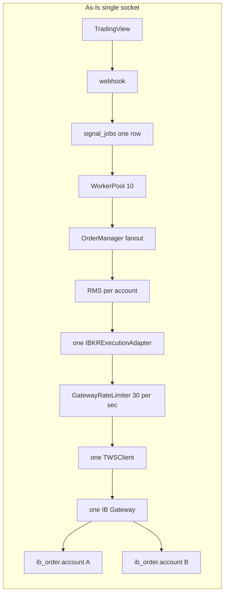
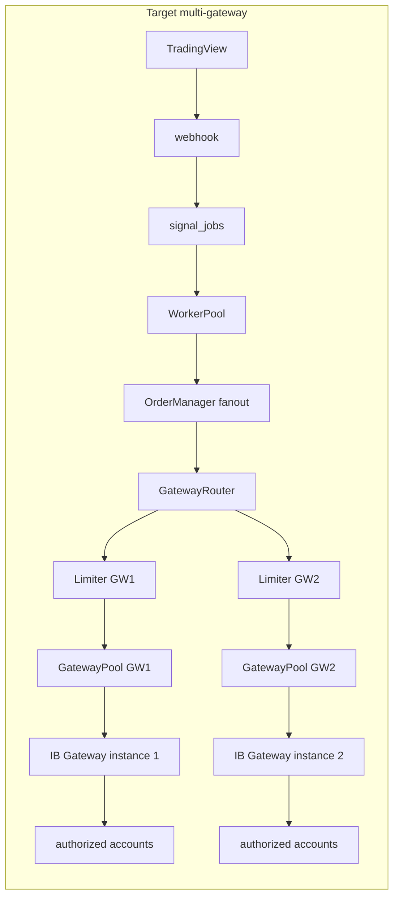
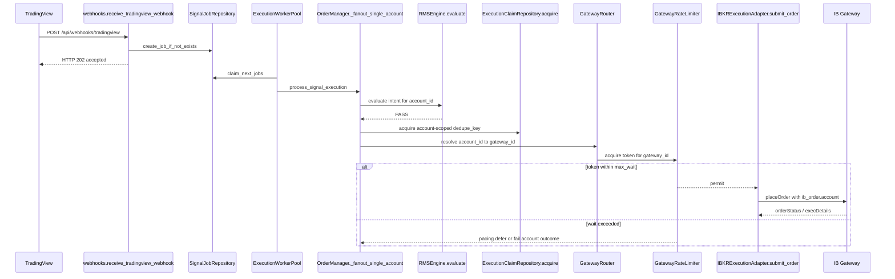

# Multi-account, multi-gateway, and rate limiting

**Verified from:** `backend/app/main.py`, `backend/app/core/config.py`, `backend/app/accounts/router.py`, `backend/app/accounts/context.py`, `backend/app/db/models/account.py`, `backend/app/services/order_manager.py`, `backend/app/services/model_blue/strategy.py`, `backend/app/oms/ibkr_adapter.py`, `backend/app/broker/ibkr/gateway_rate_limiter.py`, `backend/app/oms/oms_service.py`, `backend/app/broker/ibkr/tws_client.py`, `backend/app/api/routes/webhooks.py`, `backend/app/services/worker_pool.py`, `backend/app/db/repositories/signal_repository.py`, `backend/app/db/repositories/execution_claim_repository.py`, `backend/app/services/kill_switch.py`, `backend/app/services/recovery.py`, `backend/app/core/logger.py`, `backend/scripts/instrument_master/pacer.py`.

**Why this file exists.** No existing topic file covers N IB Gateway instances, account→gateway routing, or a per-gateway rate budget. RMS, jobs, and kill-switch behavior stay in their own docs; this file is the as-is vs target vs plan for **connectivity and routing**. Design intent that is not built lives here, labeled as target — it is not current code.

Related as-is files: [`backend-execution.md`](backend-execution.md), [`backend-rms-oms.md`](backend-rms-oms.md), [`backend-concurrency.md`](backend-concurrency.md), [`backend-config.md`](backend-config.md), [`gaps.md`](gaps.md).

---

## As-Is (current code)

Never read the target section as implemented. Each row below is what the process does today.

### Account handling — PARTIAL

**What works.** The app is **multi-account in the database and in RMS/OMS tagging**, not multi-gateway.

| Step | Code | Behavior |
|------|------|----------|
| Persist accounts | `AccountModel` in `db/models/account.py` | Columns: `id`, `name`, `ibkr_account`, `total_margin`, `enabled`. **No** host / port / clientId / gateway id. |
| Resolve strategy → accounts | `DatabaseStrategyAccountRouter.resolve` in `accounts/router.py` | Joins `accounts` × `allocations` × `strategies` where all three `enabled`, `total_margin > 0`, `alloc_pct > 0`. Returns `list[AccountExecutionContext]`. Never infers a default account. |
| Fan-out | `OrderManager._fanout_accounts` / `_fanout_single_account` in `services/order_manager.py` | One inbound signal → `asyncio.gather` of per-account tasks **in this process**. Not one OS process per account. |
| Size per account | `ModelBlueStrategy._build_open_intent` in `services/model_blue/strategy.py` | Uses `account.committed_notional` (`total_margin * alloc_pct`) via `TemporarySettingsCommittedCapitalProvider`. Sets `OrderIntent.account_id` and `OrderIntent.ibkr_account`. |
| Tag the IB order | `IBKRExecutionAdapter._build_ibkr_order` in `oms/ibkr_adapter.py` | `ib_order.account = order.intent.ibkr_account` when set. That is how IBKR distinguishes FA / managed accounts **on the same socket**. |
| RMS / claims / positions | `duplicate_lookup_key` / `open_position_key` / `exposure_key` in `rms/models.py`; `execution_dedupe_key` in `execution_claim_repository.py`; `positions` PK `(account_id, trade_id)` | Per-account isolation in risk, dedupe, and ledger. |
| Kill switch | `KillSwitchService` + `is_account_kill_switch_active` | Per-account OPEN block and flatten. See [`backend-kill-switch.md`](backend-kill-switch.md). |

**What this is not.** Independent IB logins (different usernames) cannot share one Gateway session. Today's `ib_order.account` tagging only works when **that Gateway login is authorized for those account ids** (typically one paper/live login, or an FA master). There is no `reqManagedAccts` / `managedAccounts` handling in `TWSClient`.

**Job shape (undocumented until this change).** Webhook ingest creates **one** `signal_jobs` row per TradingView alert (`webhooks._process_tradingview_webhook` → `SignalJobRepository.create_job_if_not_exists`). It does **not** pass `account_scope` (column exists, stays `NULL`). Fan-out to N accounts happens **inside** `process_signal_execution` after the worker claims that single job. Domain lock key is therefore `( "default", strategy_id )` for every live job (`ExecutionWorkerPool._get_domain_lock`).

### IB connectivity — PARTIAL (exactly one session)

| Concern | Code | Reality |
|---------|------|---------|
| How many sockets | `lifespan` in `main.py` | One `TWSClient()`, one `IBKRExecutionAdapter`, stored as `app.state.client` / `app.state.ibkr_adapter`. |
| Where it connects | `Settings.ibkr_host` / `ibkr_port` / `ibkr_client_id` in `core/config.py` | Env `IBKR_HOST` / `IBKR_PORT` / `IBKR_CLIENT_ID`. Defaults `127.0.0.1:7497` clientId `1`. |
| Handshake | `TWSClient.connect_and_start` | TCP connect, daemon reader thread, wait for `nextValidId`. Returns `False` on timeout and calls `disconnect_clean`. |
| Startup failure | `main.py` lifespan | Logs *“execution adapter will auto-reconnect on active traffic.”* **That reconnect is not implemented.** |
| Submit when down | `IBKRExecutionAdapter.submit_order` | If `not self.is_connected()`: set order `ERROR`, raise `ConnectionError("Cannot submit order: TWS is not connected.")`. No retry connect. |
| Drop while in-flight | `IBKRExecutionAdapter.on_connection_closed` | Marks every non-terminal in-memory OMS order `ERROR` / `"Connection closed unexpectedly"` and completes fill waiters. Does **not** `reqOpenOrders` first. Orders may still be live at IB. |
| Failover | — | **MISSING.** No second host, no health loop, no clientId rotation. |
| Live PnL | `LivePnlService` on the same `TWSClient` | Market-data `reqMktData` shares the one socket (and therefore the one pacer is **not** applied to those messages — pacer is `placeOrder` only). |

`IBKR_PORT` is not validated against paper vs live. See [`safety.md`](safety.md).

### Rate limiting — PARTIAL

Two pacers exist in the repo. One is on the live IB path.

| Mechanism | File | Wired in `main.py`? | What it limits |
|-----------|------|---------------------|----------------|
| `GatewayRateLimiter` (~30/24/6 msg/sec) | `broker/ibkr/gateway_rate_limiter.py` | **Yes** — one instance in `lifespan`, shared by adapter + `LivePnlService` + `TWSClient` Error 100 path | Token bucket: P0 flatten reserve, P1 `placeOrder`/`cancelOrder`, P2 `reqContractDetails`, P3 `reqMktData`. Wait+timeout (`IBKR_GATEWAY_MAX_WAIT_SEC`). Error 100 cooldown. Process-local. |
| `RatePacer` | `scripts/instrument_master/pacer.py` | **No** — discover CLI | Token bucket for `reqContractDetails` in the instrument-master script. `tests/test_pacer.py` tests this class, not `GatewayRateLimiter`. |

`GatewayRateLimiter.acquire` waits up to `max_wait_sec`, then raises `GatewayPacingTimeout` (adapter sets order ERROR, no IB send). There is no per-account fairness: N fan-out tasks share one bucket. Recovery chatter (`reqOpenOrders`, `reqExecutions`, `reqPositions`) is **not** paced yet.

IB identical-order pacing and market-data **line** caps are **not** implemented as application limiters (separate from gateway msg/sec budget).

Removed: `OrderSubmitPacer` (`oms/submit_pacer.py`), `IBKRExecutionScheduler` (`broker/ibkr/scheduler.py`).

### Order lifecycle, dedup, persistence — implemented (single socket)

See [`backend-concurrency.md`](backend-concurrency.md) and [`backend-execution.md`](backend-execution.md). Short map with citations:

| Concern | Code | As-is |
|---------|------|-------|
| Ingest idempotency | `compute_idempotency_key` + `create_job_if_not_exists` | SHA-256 of `strategy_id:signal_id:action`. Duplicate webhook returns existing job. **Not** account-scoped. |
| Durable queue | `signal_jobs` via `ExecutionWorkerPool` | 10 workers, 30s lease, same-`trade_id` serialization. |
| Pre-broker dedupe | `ExecutionClaimRepository.acquire` from `OrderManager._acquire_execution_claim` | Key `{account_id or '-'}:{strategy_id}:{signal_id}`. After RMS + resolve, before `placeOrder`. |
| In-memory OMS dedupe | `OMSService._submitted_signals` | Key `f"{intent.account_id}:{intent.signal_id}"`. |
| Fill path | `IBKRExecutionAdapter` EWrapper callbacks → `BasketCoordinator` | In-memory OMS map; `GET /api/v1/orders` reads that map, not SQL. Ledger: `orders`, `executions`, `baskets`, `positions`. |
| Crash | `RecoveryManager.run_startup_recovery` | Quarantine if orders emitted; else requeue. Best-effort `fetch_broker_order_snapshot` does not gate the decision. |

### Error handling and observability — PARTIAL

| Concern | Code | As-is |
|---------|------|-------|
| Logs | `core/logger.py` | Daily `storage/logs/{YYYY-MM-DD}/trading.log`. `trace` ContextVars: `req=` / `signal=` / `trade=` / `acct=`. |
| TWS errors | `TWSClient.error` | Codes 2000–2999 logged as status; others `warning`. Error 100 triggers `GatewayRateLimiter.notify_error_100()`. Forwarded to listeners (`on_error`). |
| Connection drop | `TWSClient.connectionClosed` | Clears handshake event; notifies listeners. Adapter then ERROR-cancels in-memory orders (see above). |
| HTTP | `webhooks.py` | 202 `accepted` is enqueue, not fill. RMS/OMS failures become `signal_jobs.status`. |
| Metrics | `GatewayRateLimiter.metrics` | In-process counters (`total_acquired`, `delayed_count`, `timeout_count`, `error100_cooldowns`, …). Logs: `IBKR submit paced`, `Gateway pacing timeout`, `IBKR Error 100 cooldown`. |

---

## Target state (not built)

Required capability: **multi-account execution across multiple IB Gateway instances, with rate limiting enforced per gateway.**

IBKR constraints this design must respect (application policy, not current code):

- One Gateway process is one login session. A second Gateway with the **same** username typically kicks the first (`ExistingSessionDetectedAction`). Independent accounts (different logins) **must** map to different Gateway processes — that mapping is isolation, not load-balancing.
- FA / advisor sub-accounts **can** share one Gateway; `order.account` selects the sub-account (this is today's tagging).
- Documented API ceiling is ~50 messages/sec **per client connection** (IB Error 100). A Gateway also caps concurrent API clients (commonly 32). Market-data **lines** and **identical-order pacing** are account/subscription limits and apply across every connection for that IB account.

### Account → gateway mapping (load-balancing vs isolation)

Because the **message budget is per Gateway connection (and conservatively per Gateway process)**, placing every account on one socket serializes them (today). Mapping is therefore both:

1. **Isolation (hard):** account A's orders may only go to a Gateway whose login is authorized for account A. Violating this is a broker reject, not a performance choice.
2. **Load-balancing (soft, same authorization set):** when several Gateways (or several clientIds) are authorized for the same account set, pick the Gateway with remaining budget / lowest utilization so one hot account does not pin the only socket.

**Proposed default policy (open to change — see questions):**

- Config is a **static** `ibkr_account → gateway_id` assignment (operator-chosen), plus an optional **authorized_accounts** list on each gateway for fail-open checks.
- Within a gateway, pick the healthiest clientId (lowest in-flight, not in backoff).
- Do **not** silently reroute an account to a Gateway that is not authorized for it in order to “balance load.”
- Dynamic rebalancing of FA sub-accounts across Gateways is **out of phase 1** — IB usually will not keep two Gateways logged in as the same FA user.

### Per-gateway connection pool

Target objects (names are design, not types in the repo):

| Object | Role |
|--------|------|
| `GatewayInstance` | `gateway_id`, `host`, `port`, `login_role` (paper/live), `authorized_ibkr_accounts[]` |
| `GatewayConnection` | One `TWSClient` + `client_id` on that instance |
| `GatewayPool` | N connections per instance; health, reconnect, nextValidId ownership |
| `GatewayRouter` | `AccountExecutionContext` → `(GatewayInstance, GatewayConnection)` |
| `GatewayRateLimiter` | One limiter **per GatewayInstance**, shared by every account and clientId on it |

Health / reconnect (target):

- Periodic `isConnected()` + handshake flag; on drop, **do not** mark broker-unknown orders `ERROR`.
- Reconnect with the same `client_id` (IBKR associates open orders with clientId). Do not rotate clientId on reconnect unless the old id is confirmed dead.
- Failover to another Gateway **only** if that Gateway is authorized for the account **and** in-flight orders on the dead socket are reconciled (`reqOpenOrders` / `reqExecutions`) so we do not double-submit.
- Kill-switch flatten must use the **same** mapping as normal orders for that account (no “flatten via any live socket”).

### Rate limiting — per gateway

#### Algorithm and where state lives

**Recommendation: one in-process token bucket (or min-interval + burst) per `gateway_id`, owned by the single FastAPI process that already runs `ExecutionWorkerPool`.**

Justification:

- Today all submits already funnel through one process (`app.main` + 10 asyncio workers). An in-process bucket is correct for that topology and matches `GatewayRateLimiter`.
- Redis is **not** on the trading path (`demo_streaming` only). Putting the hot-path limiter in Redis adds a new failure domain for every `placeOrder`.
- If a **second OS process** ever calls `placeOrder` on the same Gateway (second uvicorn, a sidecar OMS, a discover script with the same clientId — which IBKR will disconnect), in-process state is wrong. Then either:
  - **funnel** all Gateway submits through one owner process (preferred; keep the current shape), or
  - share the bucket in Redis with a Lua INCR/PEXPIRE or similar.

`scripts/oms/flatten_gateway_positions.py` is the allowed sidecar: **client id 99**, local `--pace 0.2`, dry-run unless `--apply`. Runbook: [`backend-kill-switch.md`](backend-kill-switch.md). Do not use `IBKR_CLIENT_ID`.

#### Budget: sum of clientIds vs shared ceiling

IB’s 50 msg/sec is documented **per client connection**. Two clientIds on one Gateway *might* get ~100/sec to the API, or the Gateway process may still collapse.

**Phase 1 policy: one shared ceiling per GatewayInstance (default 30 msg/sec, leaving headroom under 50), regardless of how many clientIds that instance has.** Safer against Gateway-level throttle; wastes some theoretical capacity.

**Open:** after measurement on paper Gateways, whether to raise the ceiling toward `min(50 * client_id_count, GATEWAY_PROCESS_CAP)` — do not assume a process cap until measured.

Emergency flatten: reserve a fraction of the **same** per-gateway bucket (the unwired `IBKRExecutionScheduler` 24+6 split is the intended shape). Kill-switch must not bypass the gateway limiter; it should use reserved tokens so it cannot starve, and so it cannot blow Error 100.

#### Limits that are NOT per-gateway (document separately; do not fold in)

| Limit | Binds to | Implication |
|-------|----------|-------------|
| Market-data lines | IB account / market-data subscription | `LivePnlService.reqMktData` on two Gateways for the same account still consumes the **account** line budget. Cap subscriptions per `ibkr_account`, not per gateway. |
| Identical-order pacing | IB account | Bursting the same contract/side/size from two Gateways still trips IB pacing. Dedup/pacing of identical orders is account-scoped (`execution_claims` already account-scoped; extend if needed). |
| Order pacing / Error 103 style | IB account | Same. |
| Session / login | IB username | Two Gateways, one username → session steal. Not a rate-limiter problem. |

The per-gateway limiter covers **outbound API messages on sockets attached to that Gateway** (`placeOrder`, `cancelOrder`, `reqMktData`, `reqContractDetails`, …). It does not make account-level IB rules go away.

#### Fairness (N accounts, one gateway budget)

Without fairness, fan-out + kill-switch + PnL subscribe will let one account’s burst consume the shared `GatewayRateLimiter` budget (today’s failure mode).

Target: **deficit round-robin / weighted fair queue keyed by `account_id`** on each gateway limiter.

- Each account has a quantum (default equal; optional weight from `alloc_pct` or a config field).
- Kill-switch / `EMERGENCY_FLATTEN` uses a reserved class (P0) that can spend the emergency slice but still cannot exceed the gateway ceiling.
- Market-data and contract-details sit in a lower class so they cannot starve `placeOrder`, and `placeOrder` cannot starve flatten.

#### Pacing violation

Distinguish **our limiter** vs **IB Error 100**:

| Event | Target behavior |
|-------|-----------------|
| Limiter has no token | **Wait** up to `max_wait_sec` (job lease must stay heartbeated). If wait exceeded: **do not** `placeOrder`; order ERROR / account fan-out fails. Implemented via `GatewayPacingTimeout`. |
| IB Error 100 / pacing | Immediate backoff on **that gateway** (multiply remaining tokens down / cool-down window). Surface on the order (`error_message`) and logs. Retry only if **zero** evidence of accept (`orders` row not emitted). If unknown, `RECOVERY_REQUIRED` — never blind retry. |

Single-socket limiter lacks per-account fairness and does not pace recovery snapshot calls yet.

### Backpressure when limits are hit

Webhook path already returns 202 before execution. Backpressure belongs **below** ingest:

1. Gateway limiter wait (short).
2. If still over budget: defer the **account** work (not the whole multi-account job unless every account is on that gateway) — phase 2 may split `signal_jobs` per account to make this clean.
3. Reject only the account-level outcome (`AccountExecutionOutcome.error`), persist it, do not submit.

Do not drop the durable job on the floor. Do not block TradingView HTTP on IB pacing.

### Failure semantics when a gateway dies

Replace today’s “mark everything ERROR”:

1. Socket drop → gateway unhealthy; reconnect same clientId.
2. In-flight OMS orders stay non-terminal until `reqOpenOrders` / `reqExecutions` / timeout.
3. If snapshot shows fill → persist fill, seal claim.
4. If snapshot shows working → keep waiting; do not resubmit.
5. If snapshot empty **and** we never got `orderStatus` after `placeOrder` → `RECOVERY_REQUIRED` (unknown). Operator/reconcile path — not automatic duplicate submit.
6. New OPENs for accounts whose only authorized gateway is down → fail closed (`NO_GATEWAY` / job `FAILED`), do not reroute to a random live Gateway.

---

## Proposed config schema (not in the database today)

`accounts` stays the trading identity. Gateway topology is a new table (or tables). Do not overload `ibkr_account` as a host:port.

```text
gateways
  id              bigserial PK
  name            text        -- operator label
  host            text        -- e.g. 127.0.0.1
  port            int         -- e.g. 4002 / 4003 / 7497
  enabled         bool
  paper           bool        -- documentary; app still must not assume live ports are blocked
  max_msg_per_sec numeric     -- shared ceiling for this instance (phase 1 default 30)
  emergency_reserve_per_sec numeric  -- slice of max_msg_per_sec
  max_client_ids  int         -- pool size on this process

gateway_clients
  gateway_id      FK gateways.id
  client_id       int         -- unique per gateway process
  role            text        -- trading | market_data | diagnostic
  UNIQUE (gateway_id, client_id)

account_gateway_bindings
  account_id      FK accounts.id
  gateway_id      FK gateways.id
  priority        int         -- 0 = primary
  UNIQUE (account_id, gateway_id)
```

`Settings` today has a single `IBKR_HOST`/`PORT`/`CLIENT_ID`. Target: those remain **dev defaults** for the one-gateway fallback; production bindings come from Postgres (config API) so adding a Gateway does not require a new process env per account.

Settings-page UI today edits `ibkr_account`, margin, allocations — **not** host/port. Target Settings: bind account → gateway, show gateway health. Not built.

---

## Diagrams

### As-Is vs target components





### One order on the multi-gateway path (target)



---

## Gap analysis

| Gap | Why it matters | Effort | Dependencies |
|-----|----------------|--------|--------------|
| Single `TWSClient` / single `IBKR_*` Settings | Cannot talk to a second Gateway at all | M | Pool + config schema |
| No `gateways` / `account_gateway_bindings` tables | Nowhere to store mapping; Settings page cannot assign | M | Alembic, config API, UI |
| `ib_order.account` assumes one authorized login | Independent logins silently fail or trade the wrong account | S (docs/validation) / L (true multi-login) | Pool + mapping |
| Fan-out is one job for N accounts | One Gateway down fails/blocks the whole signal; `account_scope` unused | M | Job schema / worker claim by account optional |
| Single-socket limiter not per-gateway / not fair | One bucket for all accounts; fan-out bursts share budget | M | Per-gateway limiter + DRR (Phase 2–3) |
| Recovery API calls unpaced | `reqOpenOrders` / `reqExecutions` / `reqPositions` skip limiter | S | Extend limiter coverage |
| Log line claims auto-reconnect; adapter does not reconnect | Operators trust a lie; drops black-hole submits | S | Reconnect loop |
| `on_connection_closed` marks working orders ERROR | May desync from live IB orders; duplicate risk on retry | M | Reconcile-before-ERROR |
| No Error 100 handling | IB throttle is invisible except logs | S | Limiter cooldown |
| No per-account market-data line cap | PnL subscribe can steal Gateway budget and account lines | M | Separate account-scoped md limiter |
| Live PnL and trading share one socket | Md ticks compete with `placeOrder` (and neither shares a real msg/sec budget) | M | Optional dedicated md clientId on same Gateway |
| No fairness across accounts | One burst starves flatten / other accounts | M | WF2/DRR on limiter |
| No gateway health / metrics | Cannot load-balance or alert | S | Health on pool |
| Kill-switch flatten uses same 0.2s pacer, no priority | Emergency close delayed by ordinary submits | M | Reserved tokens per gateway |
| Redis unused on trading path | Fine today; becomes a problem if multi-process submits | — | Keep single owner (preferred) |

---

## Phased plan (each phase deployable)

### Phase 1 — Make the current single Gateway honest, then pluggable

Deployable: still **one** Gateway, same paper host.

1. Document and **remove the false auto-reconnect log** (or implement reconnect for the existing client). Prefer implement: `TWSClient` reconnect with same clientId; stop marking in-flight orders ERROR on drop; adopt recovery snapshot first.
2. ~~Replace `OrderSubmitPacer` with token-bucket limiter~~ **Done** — `GatewayRateLimiter` in `broker/ibkr/gateway_rate_limiter.py`.
3. ~~Apply limiter to placeOrder and cancelOrder~~ **Done**; `reqMktData` P3 try_acquire **Done**; extend to recovery calls if needed.
4. Add `gateways` + `gateway_clients` + `account_gateway_bindings` tables; seed one row from `IBKR_HOST`/`PORT`/`CLIENT_ID` so config API has a real object. Routing function returns that only gateway. Behavior unchanged for operators.

### Phase 2 — N Gateways, static mapping, per-gateway limiter

Deployable: two paper Gateways, two independent accounts (two logins), static binding.

1. `GatewayPool`: N `TWSClient`s from `gateway_clients`.
2. `GatewayRouter`: `account_id` → primary `gateway_id`; refuse if unauthorized.
3. **One `GatewayRateLimiter` per `gateway_id`**, shared by all clientIds and accounts on that instance (phase-1 algorithm copied).
4. Fan-out submits through the router; kill-switch flatten uses the same router.
5. Settings UI: bind account → gateway; show connected/not.
6. Split **optional**: write `account_scope` on jobs or per-account child jobs so one Gateway failure does not fail every account’s outcome handling. Can ship after 2.1–2.5.

### Phase 3 — Fairness, measurement, optional extra clientIds

Deployable: same N Gateways, better behavior under burst.

1. Weighted fair queue per account on each gateway limiter; P0 reserved slice for `EMERGENCY_FLATTEN`.
2. Optional second clientId per Gateway for market data (still **same** gateway limiter).
3. Measure Error 100 vs configured ceiling; only then consider sum-across-clientIds.
4. Account-scoped market-data line cap (not in the gateway limiter).
5. Revisit Redis **only** if a second submit process is introduced.

---

## Open design questions (do not silently pick in code)

1. **50 msg/sec: per clientId or per Gateway process?** Phase 1 assumes a **shared per-Gateway ceiling**. Confirm with paper soak before summing clientIds.
2. **Can we run two Gateways as the same FA user?** If IB still session-steals, FA sub-accounts stay on one Gateway; “load-balancing” is extra clientIds, not extra processes.
3. **One `signal_jobs` row vs one row per account.** Current idempotency key has no account. Changing it rotates hashes (needs migration, same class of problem as `a4c7e2f10938`).
4. **Limiter wait vs reject vs requeue** when `max_wait` exceeded during an active lease. Preference: fail the account outcome, keep job terminal policy consistent with today’s `FAILED` vs `RECOVERY_REQUIRED` (orders emitted?).
5. **Should `reqMktData` consume the trading bucket?** Counting it is safer; isolating md on another clientId still shares the phase-1 Gateway ceiling.
6. **Redis vs single owner** if the app is ever scaled to multiple uvicorn workers (`--workers N`). Multiple workers = multiple in-process buckets = over-budget. Either refuse `--workers > 1` for `app.main` or move the limiter. **Recommendation: pin one worker process** (today’s model) and say so in ops docs.
7. **Primary/secondary bindings:** on primary down, auto-fail to secondary only if authorized **and** no in-flight unknown orders. Easy to get duplicates wrong.

---

## What existing docs already got right

Do not replace these; this file adds the missing connectivity/target layer.

- Multi-account **routing and RMS** — [`backend-rms-oms.md`](backend-rms-oms.md)
- Job/claim/recovery — [`backend-concurrency.md`](backend-concurrency.md)
- `GatewayRateLimiter` is live on the single socket — [`backend-rms-oms.md`](backend-rms-oms.md), [`safety.md`](safety.md)
- Single FastAPI process, no per-account OMS process — [`backend-execution.md`](backend-execution.md)
- Config CRUD has no gateway fields — [`backend-api.md`](backend-api.md)
- Redis not on trading path — [`backend-persistence.md`](backend-persistence.md)
